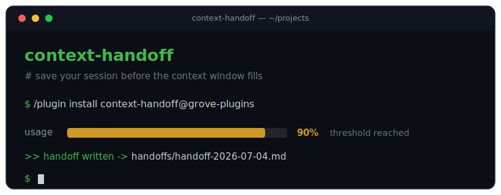

<div align="center">



<br>


**Never lose your session progress again.** Relay monitors your context usage live and automatically writes a structured handoff document at 90%, before compaction erases your work. Resume in any AI agent: Claude, Codex, Gemini, Copilot.

</div>

---

## Install

Type these **inside Claude Code** (not a terminal; they are `/` slash commands):

```text
/plugin marketplace add pushkargrover/relay
/plugin install relay@grove-plugins
```

Then restart Claude Code so hooks load at session start. No npm, no pip, no runtime.

---

## What it does

```console
every turn         ==>  read the real token count from the session transcript
     |
     v
 >= 150k tokens    ==>  instruct Claude to write an 8-section handoff (once per session)
     |
     v
 mid-task >= 190k  ==>  emergency check (throttled) after tool calls, for long turns
     |
     v
 plan >= 90%       ==>  end-of-turn check of your 5-hour plan usage (Pro/Max)
     |
     v
 compaction        ==>  PreCompact backstop = the reliable near-full signal, any model
```

- **Real counts, not estimates.** Relay reads the exact token count that every assistant message records in the transcript.
- **Token budgets, not fake percentages.** The real context window isn't exposed to hooks and varies by model, so Relay fires on an absolute token budget and lets `PreCompact` — which *does* know the true limit — handle the exact near-full moment for any model.
- **Covers long single turns.** The per-turn check runs at turn boundaries; a separate, throttled mid-task check (after tool calls, at a higher token budget) catches a long agentic task before it hits the wall.
- **Watches your 5-hour plan usage.** On Pro/Max, Relay reads the real `rate_limits.five_hour.used_percentage` that Claude Code puts in the `Stop`-hook payload and writes a handoff when your rolling plan limit hits 90% — so a lockout never catches you empty-handed. No token, no API call, no dependency.
- **Zero dependencies.** No daemon, nothing to keep running. The check rides on a hook that already fires each turn.
- **Never breaks your session.** Every failure path exits silently. A monitor must not harm what it monitors.
- **Free to run.** The check reads a local file and does arithmetic. No API call, no tokens, no impact on your usage limits.
- **On demand.** Run `/handoff` any time.

---

## Where handoffs are saved

| Session type | Location |
| --- | --- |
| Inside a project | `<project-root>/handoffs/handoff-YYYY-MM-DD-HHMMSS.md` |
| No project (home-directory session) | `~/.claude/handoffs/handoff-YYYY-MM-DD-HHMMSS.md` |

---

## The handoff document

Eight sections, readable by humans and ingestible by any AI agent:

```text
1. Session Goal              5. Open Questions / Blockers
2. Decisions Made            6. Next Steps
3. Work Completed            7. Key File Paths
4. Current State             8. Instructions for Next Agent
```

Resume in any agent with one line:

```text
Read handoffs/handoff-2026-07-04-143022.md and continue the work described there.
```

---

## Local mode — recover even after a lockout (optional, Ollama)

The triggers above rely on Claude to write the handoff — which fails in the one case you most need it: when you've **hit your plan limit and Claude is locked out**. Local mode fixes that by generating the handoff with a **local model via [Ollama](https://ollama.com)** — no Anthropic account, no internet, zero tokens.

**Setup (once):** install Ollama and pull a small model:
```text
ollama pull gemma4
```

**One-time setup** — install the short `relay-recover` command (run inside Claude Code):
```text
/relay-setup
```
Then reopen your terminal. (It auto-resolves the latest installed version, so plugin updates never break it.)

**Automatic lockout recovery.** If Relay detects a rate-limit `429` in the transcript (i.e. you've been locked out and Claude can't respond), it spawns `relay-recover` in the background automatically — the local model writes the handoff for you, no action needed. Requires Ollama; disable with `RELAY_AUTO_RECOVER=0`.

**After a lockout — run in any terminal** (or if you don't use Ollama, Claude isn't needed at all):
```text
relay-recover --list     # pick from recent sessions   (-List on PowerShell)
relay-recover            # recover the most recent session
relay-recover 2          # recover the 2nd most recent
```
It writes `handoffs/handoff-<ts>-local.md` in the current folder, generated by your local model.

**Before a lockout** (while Claude still works), run `/handoff-local` inside Claude Code for the same synthesis on demand.

> Local models are slower (~1–3 min per handoff) and rougher than Claude, but a handoff you got *after lockout* beats the perfect one you couldn't. If Ollama isn't installed, the normal Claude-written handoffs are unaffected.

---

## Configuration

Change the token budgets via environment variables in `settings.json`:

```json
{ "env": { "RELAY_TOKEN_THRESHOLD": "120000", "RELAY_EMERGENCY_TOKEN_THRESHOLD": "180000" } }
```

- `RELAY_TOKEN_THRESHOLD` (default `150000`) fires the turn-boundary handoff once context reaches this many tokens.
- `RELAY_EMERGENCY_TOKEN_THRESHOLD` (default `190000`) is the mid-task budget; keep it higher so long tasks are interrupted only when genuinely large. On a big-window model (e.g. 1M) raise both — `PreCompact` still catches the true near-full moment regardless.
- `RELAY_PLAN_THRESHOLD` (default `90`) is the 5-hour plan-usage percentage (0–100) that triggers a handoff. Only fires where Claude Code exposes `rate_limits` to hooks (terminal CLI; **not** the desktop app). Set `RELAY_DEBUG=1` to log the observed plan percentage to `~/.claude/handoffs/.relay-plan-debug.txt`.
- `RELAY_AUTO_RECOVER` (default on) — set to `0` to disable automatic local recovery when a `429` lockout is detected. Requires Ollama.
- `RELAY_OLLAMA_MODEL` (local mode) picks the Ollama model; if unset, the first installed model is auto-detected.
- `RELAY_OLLAMA_URL` (local mode) overrides the Ollama endpoint (default `http://localhost:11434`).
- `RELAY_OLLAMA_NUM_CTX` (local mode) sets Ollama's context window (default `8192`). Raise it if handoffs from very large sessions come out truncated; lower it to save memory.

Add or adjust model context windows in [`scripts/context-limits.json`](scripts/context-limits.json). The longest model-ID prefix wins, and `_default` covers unknown models conservatively.

---

<details>
<summary><b>How it works</b> (for the curious)</summary>

<br>

Claude Code writes each session as a JSONL transcript where every assistant message records exact token usage. On each `UserPromptSubmit`, a tiny script (PowerShell on Windows, `sh` + Python 3 on macOS/Linux, both already on your machine) tails that file and sums `input + cache_read + cache_creation` tokens from the newest record. Once that count crosses the token budget it emits `additionalContext` telling Claude to write the handoff. (It's an absolute token budget rather than a percentage because the true context window isn't exposed to hooks and differs per model; `PreCompact` — which Claude Code fires at the real limit — is the reliable near-full backstop.) The `PostToolUse` mid-task check is throttled so it doesn't re-read the transcript after every single tool call.

The script only **detects**. Claude does the **synthesizing**, because only the model can explain its own decisions and next steps.

**Design principles**

- The monitor never breaks the session it monitors. Every failure path exits `0` silently.
- Fires exactly once per session, using a lockfile keyed by session ID.
- Zero dependencies. No daemon, no runtime, nothing to keep running.

</details>

---

## Platform support

| Platform | Status |
| --- | --- |
| Windows (PowerShell 5.1+) | Supported |
| macOS / Linux (`sh` + Python 3) | Supported |
| Plain claude.ai chat | Not supported (no hook or filesystem access there) |

---

## Running the tests

```console
# Windows (trigger hooks)
$ powershell -NoProfile -File tests\run-tests.ps1

# macOS / Linux (trigger hooks)
$ sh tests/run-tests.sh

# local-mode parsing (any platform with Python 3)
$ python tests/test-recover.py
```

Both suites assert the same contract: boundary behavior at 89 / 90 / 91%, once-per-session locking, the `PreCompact` backstop, mid-write transcript tolerance, unknown-model fallback, and save-location rules.

---

<div align="center">

MIT &copy; <a href="https://github.com/pushkargrover">Pushkar Grover</a>

</div>
